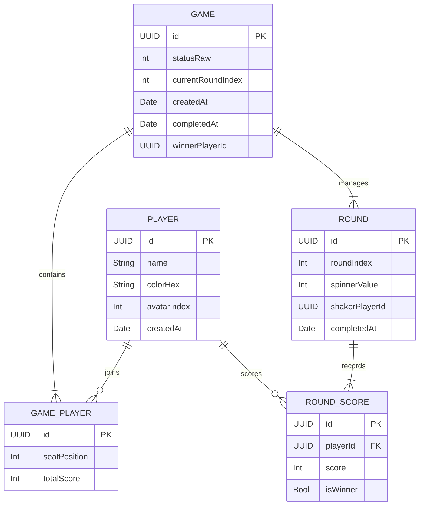

# 🏛️ Architectural Blueprint — PipTally

This document details the software architecture, database design, relational persistence models, and data-flow transitions powering PipTally.

---

## 🏗️ System Overview (MVVM + SwiftData)

The codebase implements a data-driven **Model-View-ViewModel (MVVM)** architecture where SwiftData acts as both the relational storage engine and the reactive ViewModel controller.

```text
    ┌─────────────────────────┐
    │  SwiftData SQLite DB    │◀──────────────────┐
    └────────────┬────────────┘                   │ (ModelContext
                 │ (Automatic Query               │  Transactions)
                 │  Reactive Updates)             │
                 ▼                                │
    ┌─────────────────────────┐         ┌─────────┴───────────────┐
    │   SwiftUI Views         ├────────▶│  Actions & Controllers  │
    │   (Home, ActiveGame)    │         │  (submitRound, save)    │
    └─────────────────────────┘         └─────────────────────────┘
```

* **Model Layer (`DominoModels.swift`)**: Represents SQLite relational tables. Injected at the app root, objects are tracked natively in-memory and committed asynchronously on context updates.
* **View Layer (`Views/`)**: SwiftUI components which query tracked structures reactively. Any mutation inside the `modelContext` immediately triggers a UI refresh without requiring manual observer hooks.
* **State / ViewModel Layer**: State property wrappers (`@State`, `@Binding`, `@Query`) manage navigation indexes, local input validations, and modal presentations, decoupling user interface interaction from database commits.

---

## 🗄️ Database Schemas & Relations

The app is built upon five relational entities persisted using Apple's modern `@Model` framework:



### Cascading Integrity Rules
* **Game cascade**: Deleting a `Game` automatically deletes all child entries in `GamePlayer` and `Round` via `.cascade` deletion rules, keeping the storage profile clean.
* **Round cascade**: Deleting or rolling back a `Round` cascades to delete all child scores registered inside `RoundScore`.

---

## 🔄 Round Submission & Editing Transactions

Every time a round is completed or updated, a transactional pipeline is executed inside the `modelContext` to maintain perfect standings synchronization.

### 1. Submitting a New Round
When a user inputs scores for the active round and taps "Submit Round":
1. **Inputs Validation**: The system verifies that every player has a valid, non-negative integer score in `scoresText`.
2. **Round Record Creation**: Inserts a new `Round` object with the current `roundIndex`, `spinnerValue` (according to the sequential sequence), and the `shakerPlayerId` (rotating clockwise based on round index).
3. **Round Scores Persistence**: Creates and inserts a `RoundScore` entry for each of the 4 players, linking them to the `Round` and flagging the checked trophy holder as `isWinner`.
4. **Running Total Increments**: Adds the round score directly to `GamePlayer.totalScore`.
5. **Round Step Advance**: Increments `game.currentRoundIndex` by 1.
6. **Save**: Triggers `try? modelContext.save()`, pushing changes to the SQLite database and reactively updating the live rankings leaderboard.

### 2. Editing an Existing Historical Round
When a user navigates to a past round, clicks the **Edit** pencil, adjusts scores, and taps "Save Changes":
1. **Inputs Validation**: Validates the updated numeric inputs.
2. **Locate Target Round**: Queries the existing `Round` and its child `RoundScore` objects.
3. **Recompute Standing Differences**:
   For each player:
   - Subtracts the old score value (`oldRoundScore.score`) from their `gp.totalScore` total.
   - Updates the score record with the new value and new `isWinner` status.
   - Adds the new score value (`newScoreVal`) back to `gp.totalScore`.
     $$\text{New Total} = \text{Old Total} - \text{Old Round Score} + \text{New Round Score}$$
4. **Transaction Commit**: Saves the context. The standings leaderboard reactively updates in the background, keeping lifetime player profile metrics consistent.
