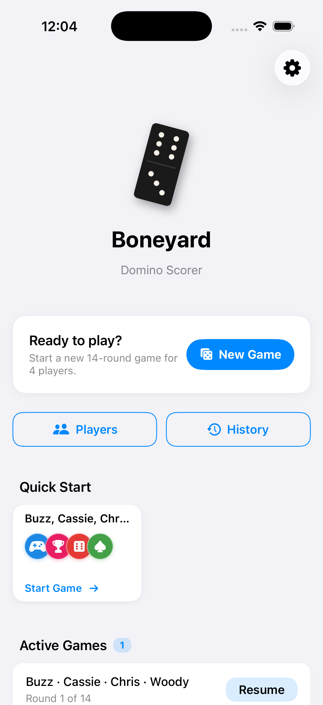

# Boneyard — Domino Scorer (iOS)

A 4-player domino score-tracking app for Mexican Train / Double-Six games. Tracks shaker rotation, spinner rounds, and cumulative scores across all 14 rounds so you can focus on the game.

Also available on [Android](https://github.com/afterefx/boneyard).

## Screenshot



---

## ✨ Features

* **🎨 Pixel-Perfect Vector Tiles (`DominoTile.swift`)**: Custom 3D-esque domino faces drawn programmatically on a SwiftUI Canvas, dynamically adjusting layout (horizontal or vertical) and pips relative to the active double-spinner value.
* **📈 Lifetime Metric Analytics (`PlayerProfileView.swift`)**: Detailed player statistics highlighting match histories, total wins, win rates, historical averages, and personal bests.
* **🔁 circular Seating Reordering (`GameSetupView.swift`)**: Interactive reordering controls allowing simple circular seating arrangements and first-round shaker selection.
* **🎯 real-Time Standings Sorted (`ScoreboardTable.swift`)**: Leaderboards automatically sorted by lowest score, highlighting the active leader with trophies and contrasting row styles.
* **🔄 Infinite Round Navigation**:
  - Navigate freely through all 14 rounds of a game (past, current, and upcoming).
  - Unplayed upcoming rounds display beautiful placeholder states.
  - A primary **"Return to Current Round"** button appears instantly at the bottom when viewing any non-active round.
* **✏️ Historical Round Editing**: A pencil icon on past rounds lets you enter edit mode, validate adjustments, and **automatically recalculate player totals** and standings.
* **💾 Local SwiftData Persistence**: Zero SQL boilerplate local database mapping relational schemas and handling cascading deletions natively.

---

## 📂 Project Structure

```text
ios-domino-score-tracker/
├── README.md                    # Project overview and quickstart
├── DESIGN.md                    # Color tokens, visual philosophy, HIG styling
├── ARCHITECTURE.md              # SwiftData relations, MVVM flow, transactions
├── CONTRIBUTING.md              # Xcode generator instructions, coding styles
├── generate_project.py          # Dynamic Xcode project generator script
├── Boneyard/
│   ├── BoneyardApp.swift        # App entry point and ModelContainer initialization
│   ├── Utils/
│   │   └── GameConstants.swift  # Double-spinner math and circular seating calculations
│   │   └── ThemeColors.swift    # Core color palette & custom themes
│   ├── Models/
│   │   └── DominoModels.swift   # SwiftData relational database entities
│   └── Views/
│       ├── HomeView.swift           # Main card-based CTA dashboard
│       ├── PlayerListView.swift     # Roster deck with swipe actions
│       ├── PlayerEditView.swift     # Profile creation and edit sheets
│       ├── PlayerProfileView.swift  # Analytics graphs and matches log registry
│       ├── GameSetupView.swift      # Seat ordering, starting shaker selector
│       ├── ActiveGameView.swift     # Live tracking console and historical editor
│       ├── GameSummaryView.swift    # Confetti celebration banner and full rounds grid
│       ├── GameHistoryView.swift    # Completed matches registry log
│       ├── SettingsView.swift       # App preferences, reset, and theme picker
│       └── Components/
│           ├── PlayerAvatar.swift   # Vector SF Symbol circular avatar with contrasts
│           ├── DominoTile.swift     # Programmatically rendered Canvas domino tile
│           ├── ScoreboardTable.swift# Compact sortable standings table
│           └── ScoreEntryRow.swift  # Interactive text field rows with trophy toggles
```

---

## 🚀 Quickstart

### 🛠️ Prerequisites
* macOS 14.0+ (Sonoma)
* Xcode 15.0+
* Swift 5.9+
* iOS SDK 17.0+ (for local simulator target builds)

### 💻 Local Compilation & Deploy
1. Clone the repository and navigate to the project directory:
   ```bash
   cd ios-domino-score-tracker
   ```
2. **Generate the Xcode Project**:
   ```bash
   python3 generate_project.py
   ```
3. **Open in Xcode**:
   ```bash
   open Boneyard.xcodeproj
   ```
4. Press **Cmd + R** inside Xcode to boot the active **iPhone Simulator** and deploy the app!

---

## 🧪 Terminal Verification

If you are working in a terminal-only environment or performing CI/CD checks, you can compile and verify the entire codebase against the host SDK:

```bash
swiftc -o /dev/null -sdk $(xcrun --show-sdk-path -sdk macosx) Boneyard/BoneyardApp.swift Boneyard/Utils/GameConstants.swift Boneyard/Utils/ThemeColors.swift Boneyard/Models/DominoModels.swift Boneyard/Views/Components/PlayerAvatar.swift Boneyard/Views/Components/DominoTile.swift Boneyard/Views/Components/ScoreboardTable.swift Boneyard/Views/Components/ScoreEntryRow.swift Boneyard/Views/HomeView.swift Boneyard/Views/PlayerListView.swift Boneyard/Views/PlayerEditView.swift Boneyard/Views/PlayerProfileView.swift Boneyard/Views/GameSetupView.swift Boneyard/Views/ActiveGameView.swift Boneyard/Views/GameSummaryView.swift Boneyard/Views/GameHistoryView.swift Boneyard/Views/SettingsView.swift
```

*This compilation check will finish with exit code `0` and zero warnings.*
