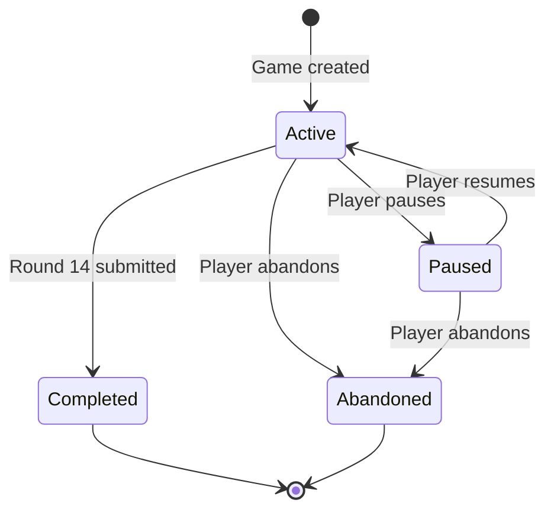
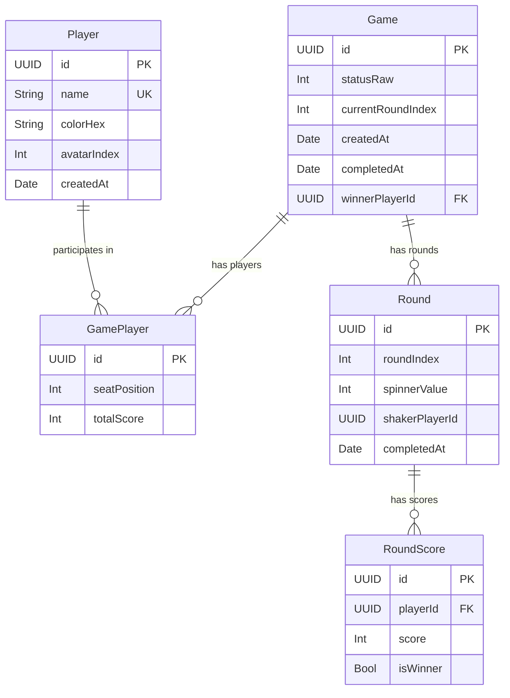

# PipTally — Product Requirements Document

**Version:** 1.0  
**Last Updated:** June 2, 2025  
**Status:** Living Document

---

## 1. Product Overview

### 1.1 Purpose

PipTally is a mobile application that digitizes score-keeping for 4-player domino games. It replaces pen-and-paper tracking with an intuitive, real-time interface that manages rounds, shaker rotation, spinner values, and running totals — letting players focus on the game, not the arithmetic.

### 1.2 Target Audience

- Casual and competitive domino players
- Families and friend groups who play regularly
- Players who want persistent game history and player statistics

### 1.3 Success Metrics

| Metric | Target |
|---|---|
| Game completion rate | ≥ 80% of started games reach round 14 |
| Time to start a game | < 60 seconds from app launch |
| Data integrity | Zero score discrepancies vs. manual tracking |

---

## 2. Game Rules & Domain Model

### 2.1 Game Rules

The app implements a standard 4-player domino game with the following rules:

| Rule | Value |
|---|---|
| Players per game | Exactly 4 (a standard double-six set has 28 tiles; each player draws 7, so 4 players is the maximum) |
| Total rounds (standard) | 14 |
| Spinner (double) sequence (14-round) | 6 → 5 → 4 → 3 → 2 → 1 → 0 → 0 → 1 → 2 → 3 → 4 → 5 → 6 |
| Spinner (double) sequence (7-round) | 6 → 5 → 4 → 3 → 2 → 1 → 0 *(planned — see §6.2)* |
| Shaker rotation | Rotates clockwise through all 4 players, cycling every 4 rounds |
| Round winner | The player who goes out first (score = 0 for that round) |
| Match winner | The player with the **lowest** cumulative score after all rounds |
| Score entry | Non-negative integers, max 3 digits (0–999) |

### 2.2 Game Lifecycle

| Status | Description |
|---|---|
| `active` | Game is in progress; players can enter scores and navigate rounds |
| `paused` | Game progress is saved; resumable from the home screen |
| `completed` | All 14 rounds finished; winner determined; game moves to history |
| `abandoned` | Game ended early by user choice; preserved in history as incomplete |

### 2.3 Data Model

**Cascade delete rules:**
- Deleting a `Game` cascades to its `GamePlayer` records, `Round` records, and their `RoundScore` records.
- Deleting a `Player` removes the player profile. Games that referenced this player retain their historical data via stored `playerId` UUIDs.

---

## 3. Functional Requirements

### 3.1 Home Dashboard

The home screen is the app's entry point and central navigation hub.

#### 3.1.1 Layout

| Element | Description |
|---|---|
| App branding | App icon (dice), app name "PipTally", tagline "Domino Scorer" |
| New Game CTA | Primary call-to-action card with "New Game" button; opens game setup flow as a modal sheet |
| Navigation shortcuts | Two outlined buttons: "Players" (navigates to player list) and "History" (navigates to game history) |
| Active Games section | Lists all games with status `active` or `paused`, sorted by creation date (newest first) |
| Settings | Gear icon in the navigation bar opens Settings as a modal sheet |

#### 3.1.2 Active Games List

Each active game card displays:
- Player names joined by ` · ` separator, sorted by seat position
- Current round progress (e.g., "Round 5 of 14")
- A right-aligned "Resume" button that navigates to the active game view

**Long-press context menu** on each game card provides:
- **Abandon Game** — sets status to `abandoned`, moves to history
- **Delete (As If Never Happened)** — permanently deletes the game and all associated data

**Empty state:** When no active games exist, display a placeholder with a gamecontroller icon and instructional text.

---

### 3.2 Player Management

#### 3.2.1 Player List

- Displays all registered players sorted alphabetically by name
- Each row shows: player avatar (medium size), player name, and join date
- Tapping a player navigates to their **Player Profile** view
- Swipe-to-delete with a destructive confirmation alert
- Plus (+) button in toolbar to add a new player
- **Empty state:** Icon, "No Players Yet" message, and "Add First Player" button

#### 3.2.2 Create / Edit Player

Presented as a modal sheet with a form containing:

| Field | Description | Validation |
|---|---|---|
| Name | Free text input, auto-capitalized by word, autocorrect disabled | Required; must be unique (case-insensitive) across all players |
| Avatar icon | Selectable from a predefined set of SF Symbols / platform icons | Required; default is first icon |
| Color | Selectable from a predefined palette | Required; default is first color |
| Preview | Live preview of the avatar with selected icon and color | Display only |

**Available avatar icons** (6 total):

| Index | Icon | Description |
|---|---|---|
| 0 | Dice (6-face, filled) | 🎲 |
| 1 | Spade (filled) | ♠️ |
| 2 | Game controller (filled) | 🎮 |
| 3 | Trophy (filled) | 🏆 |
| 4 | Target | 🎯 |
| 5 | Star (filled) | ⭐ |

**Available player colors** (8 total):

| Hex | Color |
|---|---|
| `#E53935` | Red |
| `#1E88E5` | Blue |
| `#43A047` | Green |
| `#FB8C00` | Orange |
| `#8E24AA` | Purple |
| `#00ACC1` | Cyan |
| `#E91E63` | Pink |
| `#6D4C41` | Brown |

#### 3.2.3 Player Profile

A dedicated profile screen showing:

**Header:** Extra-large avatar, player name, "Edit Profile" button (opens edit sheet)

**Lifetime Stats** (2-column grid of stat cards):

| Stat | Calculation |
|---|---|
| Games Played | Count of completed games this player participated in |
| Games Won | Count of completed games where this player was the winner |
| Win Rate | `Games Won / Games Played × 100%` |
| Avg. Score | `Sum of total scores / Games Played` |
| Best Score | Lowest total score across all completed games (lower is better) |

**Recent Games:** Chronological list (newest first) of completed games showing:
- Opponent names (joined by ` · `)
- Game date
- Player's total score
- Won/Lost indicator

---

### 3.3 Game Setup

Presented as a modal sheet with a 2-step wizard flow.

#### 3.3.1 Step 1: Player Selection

- Displays all registered players in a 2-column grid
- Each player card shows their avatar (large) and name
- Tapping a card toggles selection (checkmark badge appears)
- **Exactly 4 players** must be selected to proceed
- Counter displays "X/4 players selected"
- If fewer than 4 players exist globally, show a "Create Player" button and a dashed-border "Add Player" placeholder card
- Selection limit enforced: once 4 are selected, remaining cards become disabled (reduced opacity)
- "Next" button is disabled until exactly 4 players are selected

#### 3.3.2 Step 2: Seat Order & First Shaker

- Lists the 4 selected players with seat position numbers (1–4)
- Each player row has **up/down reorder buttons** to adjust seating order
- **First Shaker selector:** A segmented control allowing the user to pick which player shakes first
- When the first shaker is selected, the seating order is rotated so the chosen shaker occupies seat index 0
- "Start Game" button creates the game and navigates to the active game view

**Step indicator:** A progress bar with labels "Select Players" / "Set Order" showing which step is active.

**Navigation behavior:** After starting a game, the setup sheet dismisses and the active game view is pushed onto the root navigation stack. This ensures that pausing/dismissing the game always returns to the home screen — never to the setup sheet.

---

### 3.4 Active Gameplay

The primary gameplay screen for entering scores round by round.

#### 3.4.1 Round Navigation

- Horizontal navigation row with left/right chevron buttons
- Displays "Round X of 14"
- Allows browsing completed rounds (read-only) and future rounds (unplayed placeholder)
- Disabled during historical round editing

#### 3.4.2 Round Header Card

Each round displays:
- **Shaker indicator:** Crown icon + "Shaker" label + player avatar + player name
- **Spinner domino tile:** A visual domino tile rendering showing the double value for that round (e.g., Double-6 shows a 6|6 tile)
- Shaker rotation: determined by `roundIndex % playerCount`

#### 3.4.3 Round Progress

- A linear progress bar showing `currentRoundIndex / 14`
- Text: "X of 14 rounds completed"

#### 3.4.4 Score Entry (Current Round)

For each player, a `ScoreEntryRow` displays:
- Player avatar (small)
- Player name
- Score text field: numeric input, max 3 digits, validated as non-negative integer
- Trophy toggle button: tapping marks the player as the round winner
  - When a player is marked as winner, their score is automatically set to `0` and the score field becomes disabled
  - Only one player can be the round winner per round
  - Toggling off the winner clears their score back to empty

**Validation:** On submit, every player must have a valid non-negative integer score. Fields with errors show a red border and "Required" label.

#### 3.4.5 Viewing Historical Rounds

When browsing a previously completed round:
- Scores are displayed as read-only text (not editable fields)
- Round winners are indicated with a trophy icon
- An "Edit" button allows modifying the historical round's scores

#### 3.4.6 Editing Historical Rounds

When editing a past round:
- Score fields become interactive (pre-populated with existing values)
- Winner trophy toggle becomes active
- Bottom bar shows "Cancel" and "Save Changes" buttons
- Round navigation is disabled during editing
- On save: the score differences are computed and applied to each player's running total

#### 3.4.7 Viewing Future Rounds

When navigating past the current round:
- Displays a placeholder with clock icon: "Round X is Unplayed"
- Instructional text about completing the current round first

#### 3.4.8 Standings Panel

- Collapsible "Standings" section with Show/Hide toggle
- Displays a `ScoreboardTable` component ranking players by total score (ascending — lowest is best)
- Each row shows: rank badge, player avatar, player name, total score
- The leader (#1 rank) gets highlighted styling (accent color, green tint background)

#### 3.4.9 Bottom Bar Controls

| State | Controls |
|---|---|
| Current round | **Submit Round** |
| Viewing history (not editing) | **Return to Current Round** |
| Editing history | **Cancel** (red outline) + **Save Changes** |

> [!NOTE]
> There is no undo button. Because players can navigate to any completed round and edit its scores at any time (§3.4.5–3.4.6), a dedicated undo action is unnecessary.

#### 3.4.10 Pause / Resume

- Pause button (⏸) in the navigation bar toolbar
- Triggers a confirmation alert: "Pause Game?" with "Pause" and "Keep Playing" options
- On pause: game status set to `paused`, user is returned to the home dashboard
- **Back gesture / back button during gameplay always triggers the pause confirmation dialog — never exits the game directly**
  - Android: system back gesture is intercepted by a `BackHandler` that shows the pause dialog; on the home screen the back gesture exits the app normally; settings opens as a bottom sheet and the back gesture dismisses it
  - iOS: the system back button and swipe-back gesture are hidden (`navigationBarBackButtonHidden`), preventing accidental exits; the pause button is the only exit path; settings opens as a modal sheet and the swipe-down / Done button closes it

#### 3.4.11 Game Completion

When round 14 is submitted:
- The player with the **lowest** cumulative total score is determined as the match winner
- Game status is set to `completed`, `completedAt` timestamp is recorded
- `winnerPlayerId` is set on the game record
- Navigation automatically transitions to the Game Summary view

---

### 3.5 Game Summary

Displayed after game completion or when viewing a completed game from history.

#### 3.5.1 Completed Game Summary

**Winner hero section:**
- Confetti decoration rows (colored rectangles with rotation)
- Large trophy icon
- Winner's avatar (extra-large) with gold outer ring
- Winner's name and winning score (e.g., "Wins with 142 points")
- Completion date

#### 3.5.2 Abandoned Game Summary

- Orange octagon icon instead of trophy
- "Game Abandoned" heading
- "This game was ended in round X" message
- Abandoned date

#### 3.5.3 Round-by-Round Score Grid

A full tabular breakdown:
- **Column headers:** Player avatars and names (truncated to 6 chars)
- **Row per round:** Domino tile showing the spinner value, each player's score for that round
- Round winners indicated with a star (⭐) icon
- Winner column highlighted with green tint
- **Totals row:** Bold final scores for each player
- "Done" button returns to the home dashboard

---

### 3.6 Game History

- Lists all completed and abandoned games, sorted by creation date (newest first)
- Each row shows:
  - For completed games: winner's avatar, player names, completion date, winner's score + "Winner" badge
  - For abandoned games: orange octagon icon, player names, abandon date, "Incomplete" label + round progress
- Tapping a row navigates to the Game Summary view
- Swipe-to-delete to permanently remove historical game records
- **Empty state:** Clock icon, "No Game History" message

---

### 3.7 Settings

#### 3.7.1 Theme / Appearance

Three theme options presented as a selectable list:

| Theme | Color Scheme | Background | Surface |
|---|---|---|---|
| **System** | Follows OS light/dark setting | System grouped background | System secondary grouped background |
| **OLED Pure Black** | Always dark | `#000000` | `#121212` |
| **Slate Deep Gray** | Always dark | `#121212` | `#1E1E1E` |

Each theme option shows:
- Color preview circles (background + surface)
- Theme name and description
- Checkmark for selected theme

**Live preview card:** A miniature mock-up using the currently active theme colors, so the user sees the effect before committing.

**Reactivity:** Theme changes apply immediately across the entire app without requiring a restart.

#### 3.7.2 About Section

- Architecture description text
- App version display (e.g., "1.0.0 (Build 1)")

#### 3.7.3 Danger Zone

- **Reset All Application Data** button (destructive)
- Confirmation alert with warning text
- Deletes all: Games, Players, Rounds, RoundScores, GamePlayers
- Success confirmation alert

---

## 4. UI/UX Specifications

### 4.1 Player Avatar Component

A reusable component used across the entire app.

**Rendering logic:**
- Circular background filled with the player's chosen color
- If a valid avatar icon index is set: renders the icon symbol centered
- Fallback: renders the first letter of the player's name (uppercase)
- Icon/letter color adapts based on background luminance (white on dark, near-black on light)
- Border: white, semi-transparent
- Shadow: tinted to the player's color

**Size variants:**

| Size | Diameter | Font Size | Border Width | Shadow Radius |
|---|---|---|---|---|
| Small | 32pt | 13pt | 1.5pt | 2pt |
| Medium | 48pt | 18pt | 2pt | 3pt |
| Large | 64pt | 24pt | 2pt | 4pt |
| X-Large | 96pt | 36pt | 3pt | 6pt |

### 4.2 Domino Tile Component

A custom-rendered visual domino tile using canvas/2D drawing:
- Dark background (`#1A1A1A`) with rounded corners
- Cream-colored pips (`#F5F0E8`) positioned according to standard domino face layouts
- Divider line (`#3A3A3A`) separating top and bottom halves
- Supports both vertical and horizontal orientation
- Configurable width (height = 2× width)
- Pip positions follow standard domino arrangements for values 0–6

### 4.3 Semantic Colors

The app defines a set of semantic colors that adapt based on the active theme:

| Token | System | OLED Pure Black | Slate Deep Gray |
|---|---|---|---|
| `appBackground` | `.systemGroupedBackground` | `#000000` | `#121212` |
| `appSurface` | `.secondarySystemGroupedBackground` | `#121212` | `#1E1E1E` |
| `appRowBackground` | `.systemBackground` | `#1C1C1E` | `#2C2C2E` |
| `appGray` | `.systemGray6` | `#2C2C2E` | `#3A3A3C` |

### 4.4 Color Format

The app supports hex color strings in both 6-digit (`#RRGGBB`) and 8-digit (`#AARRGGBB`) formats. The 8-digit format includes alpha transparency and is compatible with Android color representations.

---

## 5. Non-Functional Requirements

### 5.1 Data Persistence

- All data is stored locally on-device using a relational local database (SwiftData on iOS, Room on Android)
- Data survives app restarts, OS updates, and device reboots
- Cascade deletion rules maintain referential integrity

### 5.2 Performance

- App launch to interactive home screen: < 1 second
- Round submission and score recalculation: instantaneous (< 100ms)
- Smooth 60fps animations for theme transitions, navigation, and UI interactions

### 5.3 Offline-First

- The app requires zero network connectivity
- All features work fully offline

### 5.4 Platform Requirements

| Platform | Minimum Version |
|---|---|
| iOS | 17.0+ |
| Android | API 26 (Android 8.0)+ |

### 5.5 Accessibility

- All interactive elements should have meaningful accessibility labels
- Score inputs should announce their player context to screen readers
- Theme options should be navigable via VoiceOver / TalkBack

---

## 6. Future Roadmap

> [!NOTE]
> The following items are planned enhancements beyond the v1.0 scope. They are prioritized by estimated user impact and feasibility.

### 6.1 Near-Term (v1.1–v1.2)

| Feature | Description | Priority |
|---|---|---|
| Expanded avatar icons | Add 10–15 additional icons for player personalization (e.g., animals, food, sports) | High |
| Custom player colors | Allow users to pick any color via a color wheel, beyond the preset palette | Medium |
| Game templates / quick start | Allow saving a group of 4 players as a "table" for one-tap game creation | High |
| Hidden score mode | Game creator option to hide the running standings/scoreboard until the final round is completed, adding suspense | High |
| Haptic feedback | Tactile feedback on trophy toggle, round submit, game completion | Medium |
| Sounds / audio cues | Optional domino shuffle sound on game start, celebration on win | Low |

### 6.2 Mid-Term (v1.3–v2.0)

| Feature | Description | Priority |
|---|---|---|
| 7-round game mode | Option to play a shorter 7-round game with spinner sequence 6 → 5 → 4 → 3 → 2 → 1 → 0. Player count remains fixed at 4. | Medium |
| Cloud sync & backup (paid tier) | Sync and backup game data to a first-party service provided by the app developer. This is a **paid subscription feature** — no iCloud, Google Drive, or third-party export. Users cannot export their data. | High |
| Multiplayer score entry | Each player creates an account (username + email) on their own device. The game host adds friends by searching their username or email. During gameplay, the host manages round progression, but each player enters their own individual score from their own device. Upon game completion, the full game summary and stats are distributed to all participants, and the game is attached to each player's account history. This is a **paid subscription feature**. | Medium |
| Player photos | Allow camera/gallery photos as avatar images in addition to icons. **Under consideration** — hosting/storage costs for user-uploaded images need to be evaluated. | Low |

### 6.3 Long-Term (v2.0+)

| Feature | Description | Priority |
|---|---|---|
| Cross-platform sync | Sync data between iOS and Android via the first-party cloud service (extends the paid sync tier) | High |
| Leaderboard & rankings | Group-based leaderboards with ELO-style rankings among players on the same sync account | Medium |
| Game analysis & insights | Charts showing score trends, round-by-round performance, hot streaks | Medium |
| Widget support | Home screen widgets showing active game status or player stats | Low |

---

## 7. Glossary

| Term | Definition |
|---|---|
| **Spinner** | The double domino that determines the round's value (e.g., Double-6 = spinner value 6) |
| **Shaker** | The player who shuffles and deals the dominoes for a given round; rotates each round |
| **Pip** | A single dot on a domino face; the spinner value refers to the pip count |
| **Seat position** | A player's fixed position (0–3) at the table for the duration of a game |
| **Round winner** | The player who plays all their dominoes first in a round; scores 0 points |
| **Match winner** | The player with the lowest cumulative score after all rounds |
| **Running total** | Each player's cumulative score across all completed rounds, stored on `GamePlayer.totalScore` |
